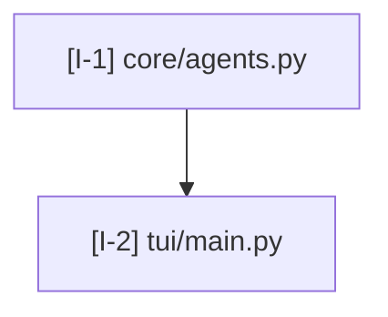
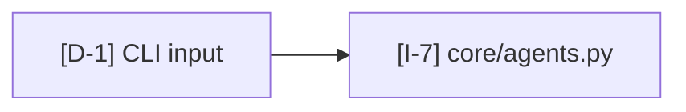
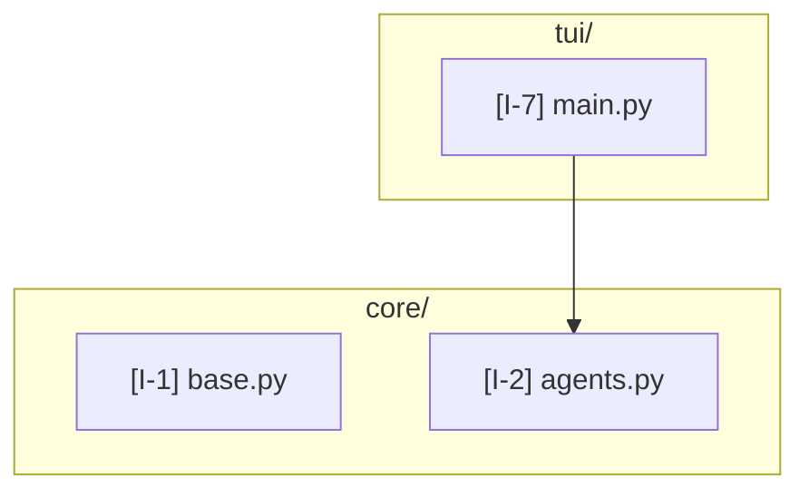

# Mermaid Conventions

How diagrams are authored across all seven modes. Pinning these conventions early is what makes the cross-mode callout index work — the same `[I-7]` resolves identically whether referenced from the IA report or the data-flow report.

## Diagram type per mode

| Mode | Primary | Optional secondary |
|---|---|---|
| Information architecture | `graph TD` (top-down module hierarchy) | C4 container diagram |
| Data flow | `flowchart LR` (left-right pipeline) | `sequenceDiagram` per critical path |
| Integrations | C4 context boundary diagram | dependency table (markdown) |
| UI surfaces | `graph TD` route tree | `graph TD` component graph with state overlay |
| Interaction patterns | `graph TD` per-surface pattern decomposition | pattern × surface matrix (markdown table) |
| Data model | `erDiagram` | — |
| Control flow | `stateDiagram-v2` | `sequenceDiagram` per execution flow |
| Failure modes | `flowchart TD` with error edges | — |

When a mode has both a primary and a secondary diagram, the primary lands in the canonical `<mode>.mmd` (e.g., `data-flow/flow.mmd`). Secondaries get descriptive filenames (`data-flow/sequence-tui-bootstrap.mmd`). Both render to SVG in the same dir.

## Callout prefixes

Every node ID in mermaid carries a callout prefix tied to its mode. Stable across the whole report — a node first introduced in the IA diagram keeps its `[I-12]` ID when referenced from the data-flow diagram.

| Prefix | Mode |
|---|---|
| `I-` | Information architecture |
| `D-` | Data flow |
| `X-` | Integrations (eXternal) |
| `U-` | UI surfaces |
| `P-` | Interaction patterns |
| `M-` | Data model |
| `C-` | Control flow |
| `F-` | Failure modes |

In mermaid, encode the callout in the node label so it survives rendering:



The bracketed prefix-N is the visible callout. Use the same string in the report's callout table.

## Cross-mode references

When a mode's diagram needs to reference a node defined in another mode, use the *original* callout. Don't re-number. The synthesis README's cross-mode index resolves the lookup.

Example — a data-flow diagram references the IA's `[I-7]` (the agents module):



Render with `classDef cross-mode` styling so the borrowed node visually differs (see classDefs below).

## classDef conventions

Five styles applied with `classDef` and `class` directives. Keep these consistent across modes for visual continuity in the rendered PDF.

```mermaid
classDef cited fill:#fff,stroke:#333,stroke-width:1px
classDef synthesized fill:#fff,stroke:#888,stroke-width:1px,stroke-dasharray:5
classDef external fill:#f0f4ff,stroke:#3b6ea5,stroke-width:1px
classDef crossmode fill:#fdf6e3,stroke:#b58900,stroke-width:1px
classDef removed fill:#fde7e7,stroke:#c0392b,stroke-width:1px,stroke-dasharray:3
```

- **cited** (default) — node has a verified `path:line` citation.
- **synthesized** — node has no single owning file (≤20% per mode, see `citation-protocol.md`).
- **external** — node represents a third-party system, service, or library boundary. Mostly used in integrations diagrams.
- **crossmode** — node defined in a different mode, referenced here for context.
- **removed** — node that *used to exist* and was deleted; only used when explicitly tracking architectural change.

Apply with the `class` directive at the bottom of the diagram:

```mermaid
class I3 synthesized
class X1,X2,X3 external
class I7 crossmode
```

## Edge styling

| Edge type | Mermaid syntax | Meaning |
|---|---|---|
| Verified | `A --> B` | Solid arrow, citation in report |
| Synthesized | `A -.-> B` | Dotted; relationship is real but no single line owns it |
| Bidirectional | `A <--> B` | Two-way relationship (e.g., request/response) |
| Conditional | `A -->|condition| B` | Edge only taken under named condition |
| Error path | `A -.->|error| B` | Failure-mode edges; dotted with label |

Avoid double-headed and curved arrows in `flowchart` — they render inconsistently across mermaid versions. Use `<-->` only when the bidirectional nature is essential.

## Layout direction per mode

Defaults that work well in rendered SVGs:

- IA: `graph TD` — hierarchy reads top-down.
- Data flow: `flowchart LR` — left = input, right = output.
- UI surfaces (routes): `graph TD` — root route at top.
- UI surfaces (components): `graph LR` — parent components on left.
- Failure modes: `flowchart TD` — happy path top, error edges branching off.
- Sequence diagrams: as-is (always vertical).

Override only when a specific diagram reads better otherwise — note the override in the diagram's leading comment.

## Subgraphs

Use `subgraph` blocks to group nodes by file, package, or trust boundary. Keep subgraphs shallow (one level of nesting); mermaid's nested subgraph rendering degrades quickly.



## Node label hygiene

- Lead with the callout in brackets: `[I-7] tui/main.py`.
- Keep labels under ~40 characters. Long labels overflow rendered SVGs.
- Use the symbol's repo-relative path or an unambiguous short name. `main.py` alone is ambiguous; `tui/main.py` or `TUI shell` is fine.
- Escape special characters: parentheses, colons, and quotes need quoting (`["..."]`).

## Rendering

Render with the bundled script:

```
bash scripts/render.sh docs/architecture/<date>/
```

The script iterates each mode subdirectory and produces SVG siblings of every `.mmd` via `mmdc` (mermaid CLI). If `mmdc` is not installed, the script prints an installation hint and exits non-zero — citations and reports are still authored, just not rendered to SVG until the user installs mmdc.

## What NOT to do

- **No emoji in diagrams.** Renders inconsistently and clutters the visual signal.
- **No styling per-node with inline `style` directives.** Use `classDef` + `class` so the convention is centralized.
- **No nodes without callouts.** A node with no `[X-N]` prefix has no row in the callout table, which means no citation, which means it shouldn't exist.
- **No dangling edges.** Every edge connects two nodes that both exist in the callout table.
