# Mermaid Diagram Types Reference

Syntax, patterns, and code examples for every major Mermaid diagram type.

---

## Flowchart

Best for: process flows, decision trees, system overviews.

### Basic Syntax

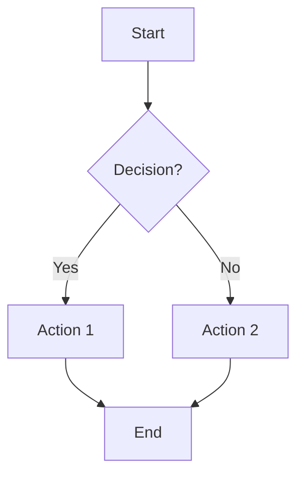

### Direction Options

| Direction | Meaning |
|-----------|---------|
| `TD` / `TB` | Top to bottom |
| `BT` | Bottom to top |
| `LR` | Left to right |
| `RL` | Right to left |

### Node Shapes

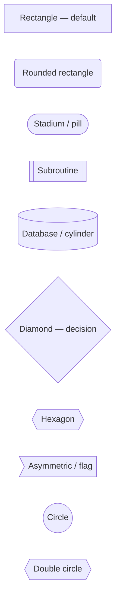

### Edge Types

```mermaid
flowchart LR
    A --> B
    A --- C
    A -.-> D
    A ==> E
    A --"label"--> F
    A -.."dashed label".-> G
    A =="thick label"==> H
```

| Syntax | Meaning |
|--------|---------|
| `-->` | Solid arrow |
| `---` | Solid line (no arrow) |
| `-.->` | Dashed arrow |
| `==>` | Thick arrow |
| `--"text"-->` | Labeled arrow |
| `~~~` | Invisible link (for layout) |

### Subgraphs

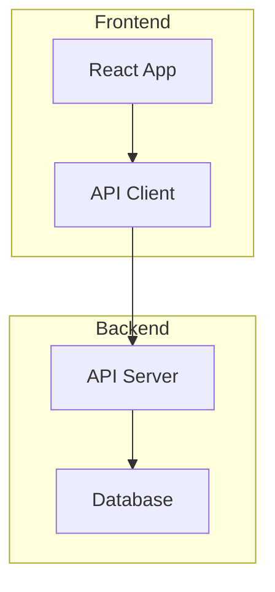

### Styling

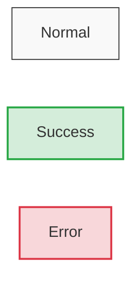

---

## Sequence Diagram

Best for: API interactions, message passing, time-ordered communication.

### Basic Syntax

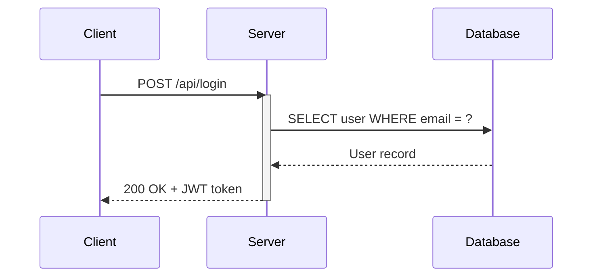

### Arrow Types

| Syntax | Meaning |
|--------|---------|
| `->>` | Solid arrow (synchronous) |
| `-->>` | Dashed arrow (response/async) |
| `-x` | Solid arrow with X (lost message) |
| `--x` | Dashed arrow with X |
| `-)` | Solid arrow, open end (async fire-and-forget) |
| `--)` | Dashed arrow, open end |

### Features

**Activation boxes:**
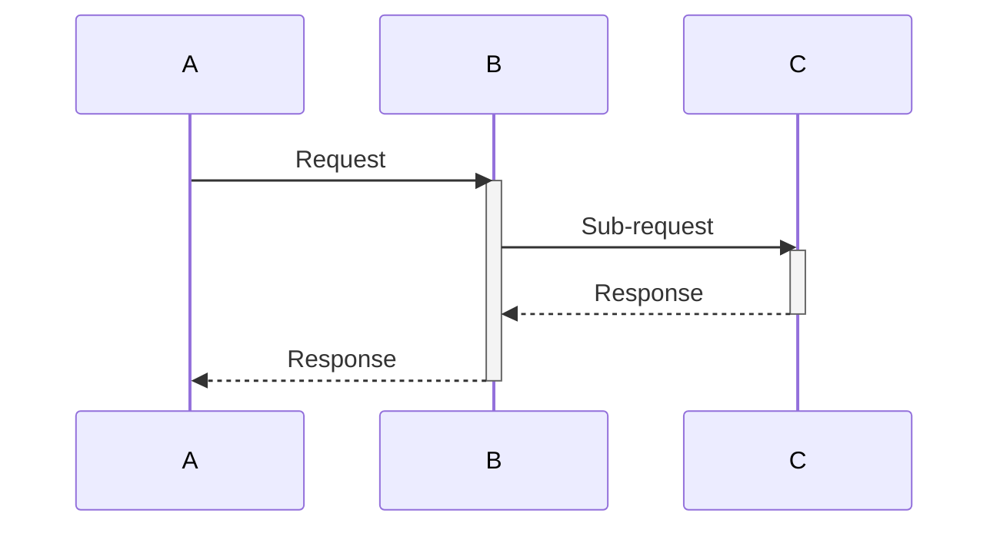

**Loops and conditions:**
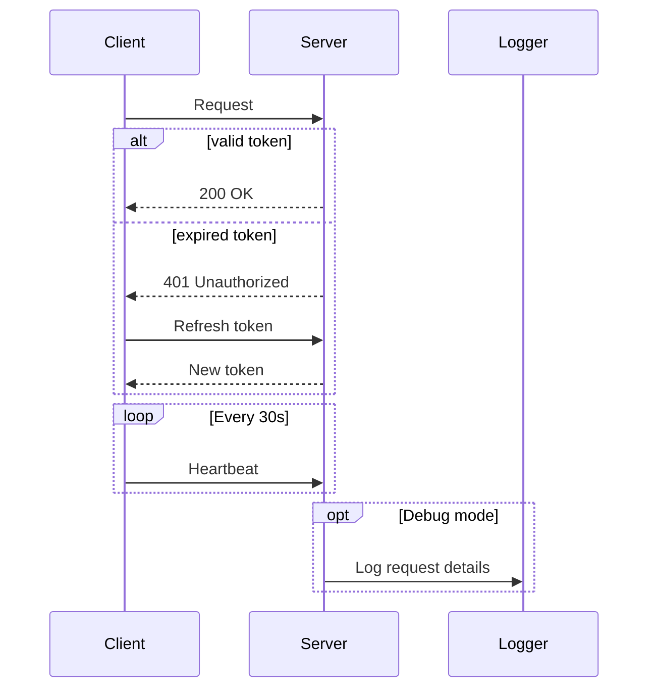

**Notes:**
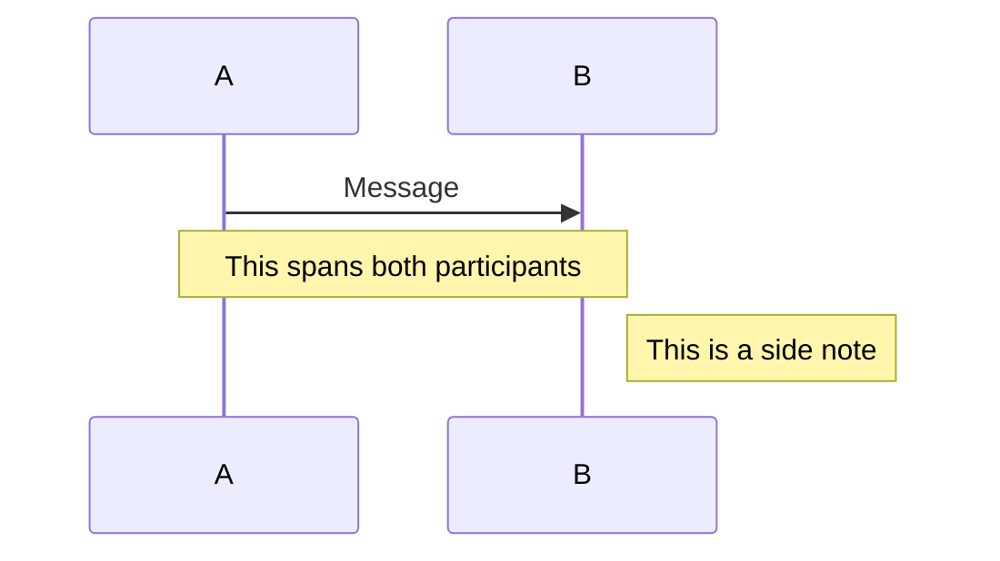

---

## Class Diagram

Best for: object models, inheritance, interfaces.

### Basic Syntax

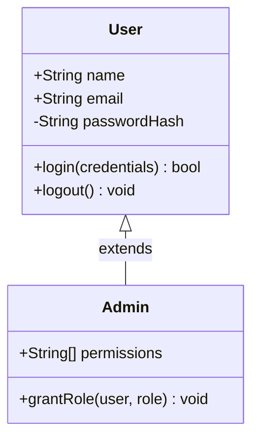

### Relationship Types

| Syntax | Meaning |
|--------|---------|
| `<\|--` | Inheritance |
| `*--` | Composition |
| `o--` | Aggregation |
| `-->` | Association |
| `..>` | Dependency |
| `..\|>` | Realization / implements |

### Cardinality

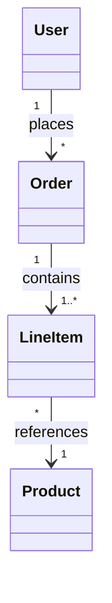

---

## State Diagram

Best for: lifecycle states, workflow transitions, finite state machines.

### Basic Syntax

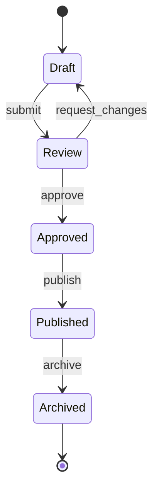

### Composite States

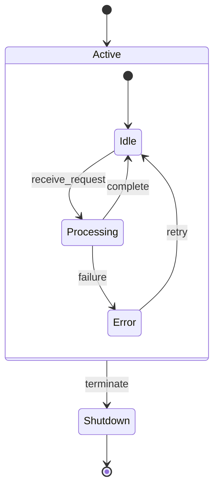

### Transitions with Guards

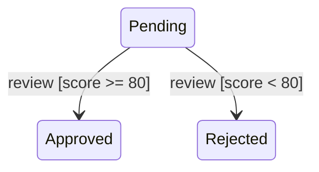

---

## Entity Relationship Diagram

Best for: database schemas, data models.

### Basic Syntax

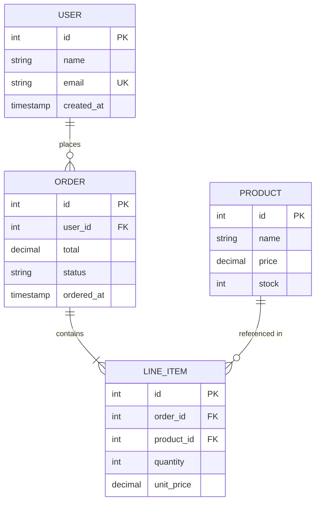

### Relationship Notation

| Left | Right | Meaning |
|------|-------|---------|
| `\|\|` | `\|\|` | Exactly one to exactly one |
| `\|\|` | `o{` | One to zero or more |
| `\|\|` | `\|{` | One to one or more |
| `o\|` | `o{` | Zero or one to zero or more |

---

## Gantt Chart

Best for: project timelines, task scheduling, dependencies.

### Basic Syntax

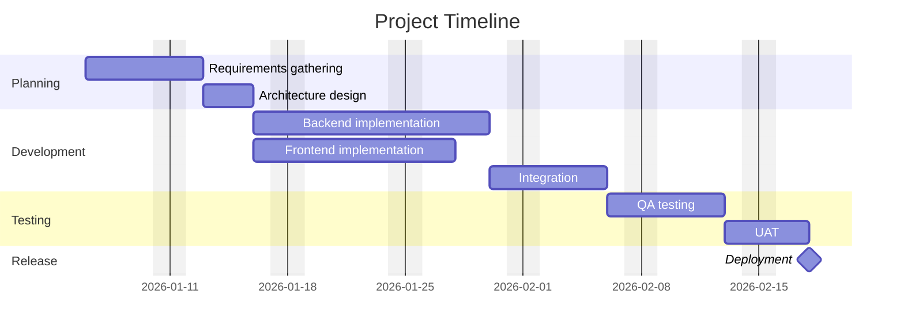

### Task Status

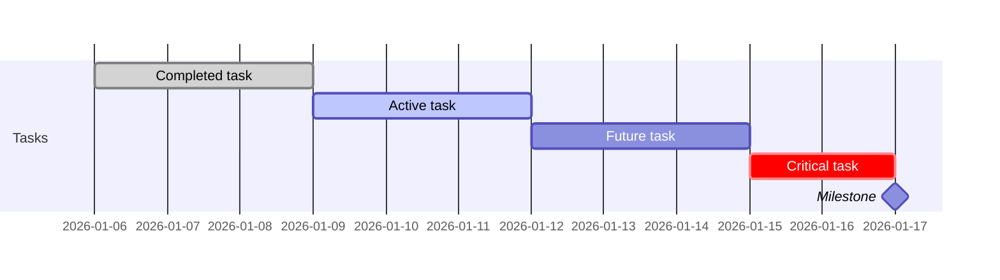

---

## Pie Chart

Best for: proportional data, distribution breakdowns.

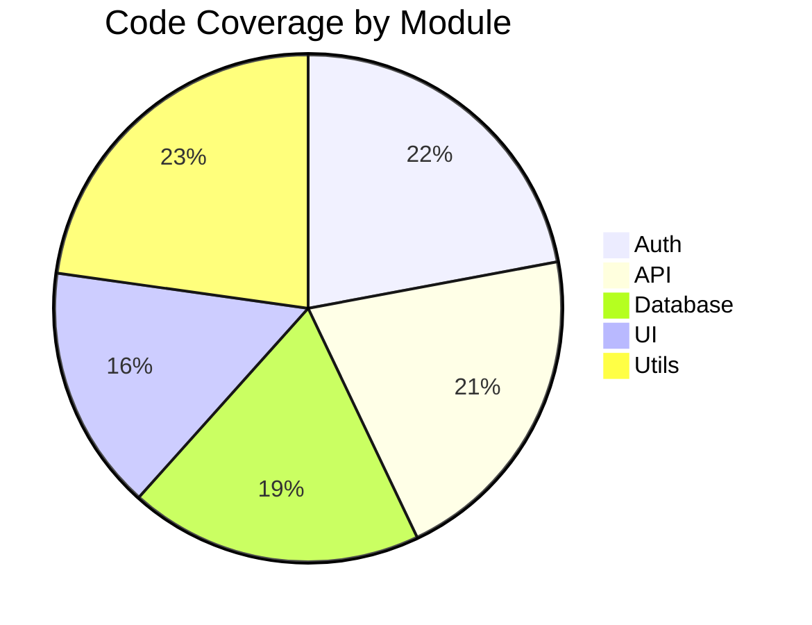

---

## Mindmap

Best for: hierarchical brainstorming, topic organization.

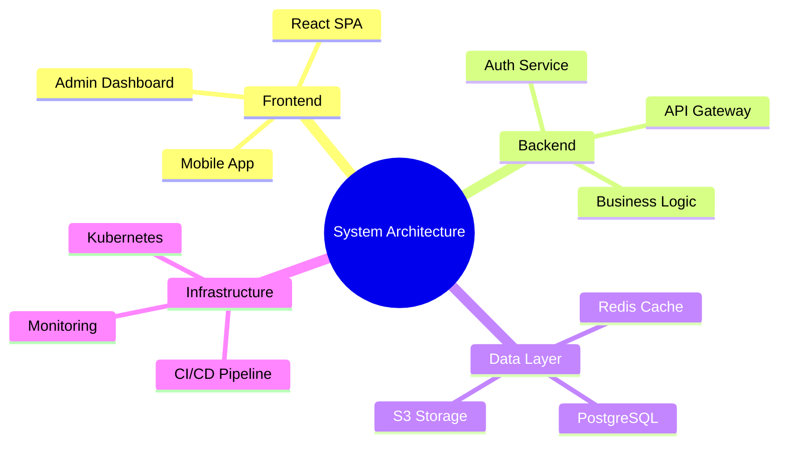

---

## Timeline

Best for: historical events, version history, milestones.

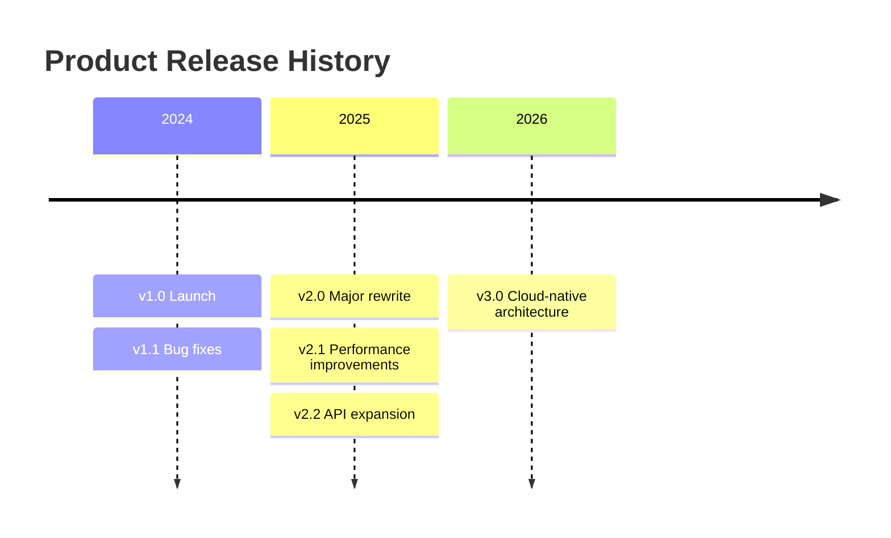

---

## Git Graph

Best for: branching strategies, release flows.

```mermaid
gitGraph
    commit id: "init"
    branch develop
    commit id: "feat-1"
    commit id: "feat-2"
    branch feature/auth
    commit id: "auth-impl"
    commit id: "auth-tests"
    checkout develop
    merge feature/auth
    checkout main
    merge develop tag: "v1.0.0"
    branch hotfix/security
    commit id: "patch"
    checkout main
    merge hotfix/security tag: "v1.0.1"
```

---

## User Journey

Best for: user experience flows, satisfaction mapping.

```mermaid
journey
    title User Onboarding Experience
    section Sign Up
      Visit landing page: 5: User
      Fill registration form: 3: User
      Verify email: 2: User
    section First Use
      Complete tutorial: 4: User
      Create first project: 4: User
      Invite team member: 3: User
    section Activation
      Use core feature: 5: User
      Set up integration: 3: User
```

The number (1-5) represents user satisfaction at that step.

---

## Styling Tips

### Global Theme Configuration

```mermaid
%%{init: {
  'theme': 'base',
  'themeVariables': {
    'primaryColor': '#4A90D9',
    'primaryTextColor': '#fff',
    'primaryBorderColor': '#2C6FAC',
    'lineColor': '#666',
    'secondaryColor': '#F5A623',
    'tertiaryColor': '#7ED321',
    'fontSize': '14px'
  }
}}%%
```

### Available Themes

| Theme | Use for |
|-------|---------|
| `default` | Standard Mermaid colors |
| `neutral` | Grayscale, print-friendly |
| `dark` | Dark backgrounds |
| `forest` | Green-toned |
| `base` | Customizable starting point |

### Accessibility Checklist

- [ ] Colors have sufficient contrast (WCAG AA minimum)
- [ ] Meaning is not conveyed by color alone (use labels and shapes)
- [ ] Diagrams have alt text when embedded in HTML/markdown
- [ ] Complex diagrams include a text summary
- [ ] Font size is readable (14px minimum)
